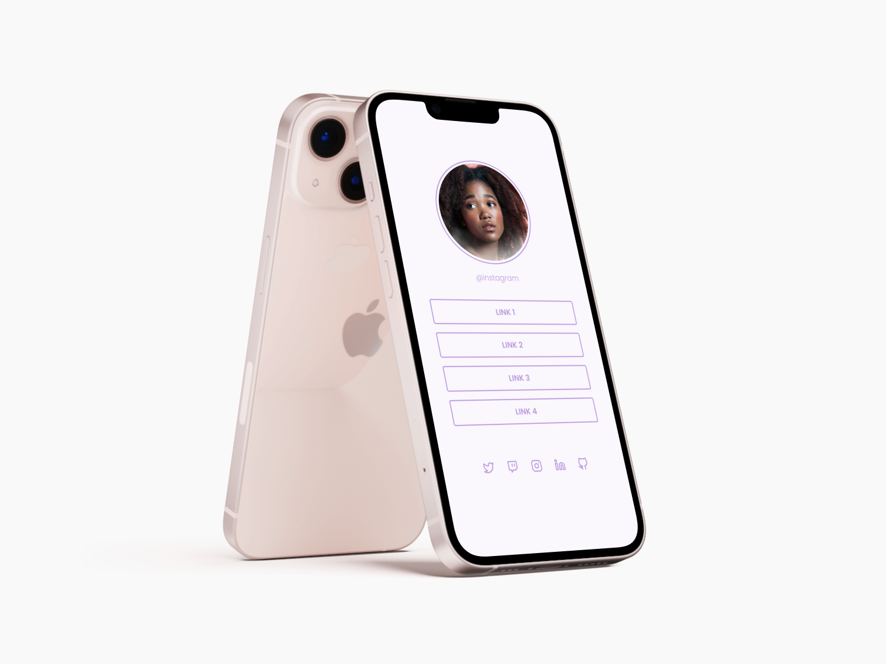

<h1 align="center">Social Tree 📱🤳</h1>

<p align="center">
  <a href="#-tecnologias">Tecnologias</a>&nbsp;&nbsp;&nbsp;|&nbsp;&nbsp;&nbsp;
  <a href="#-projeto">Projeto</a>&nbsp;&nbsp;&nbsp;|&nbsp;&nbsp;&nbsp;
  <a href="#-demo">Demo</a>&nbsp;&nbsp;&nbsp;|&nbsp;&nbsp;&nbsp;
  <a href="#-layout">Layout</a>&nbsp;&nbsp;&nbsp;|&nbsp;&nbsp;&nbsp;
  <a href="#memo-licença">Licença</a>
</p>

<p align="center">
  

  
  
  

  
</p>

<br>

<p align="center">
  
</p>
<p align="center">
  
</p>

## 🧪 Tecnologias

Esse projeto foi desenvolvido com as seguintes tecnologias:

- HTML
- CSS

## 💻 Projeto

Social Tree é uma página que pode ser usada por perfis nas redes sociais para direcionar o usuário para um local escolhido.

## 🧐 Demo

Quer dar uma olhadinha de como ficou?

Acesse: [SocialTree](https://guilhermequeico.github.io/socialtree/)

## 🚀 Como executar

Clone o projeto e acesse a pasta do mesmo.

```bash
$ git clone https://github.com/guilhermequeico/socialtree.git
$ cd socialTree
```
Agora é só abrir o arquivo <i>index.html</i> em seu navegador de preferência.

## :memo: Licença

Esse projeto está sob a licença MIT. Veja o arquivo [LICENSE](LICENSE) para mais detalhes.

---